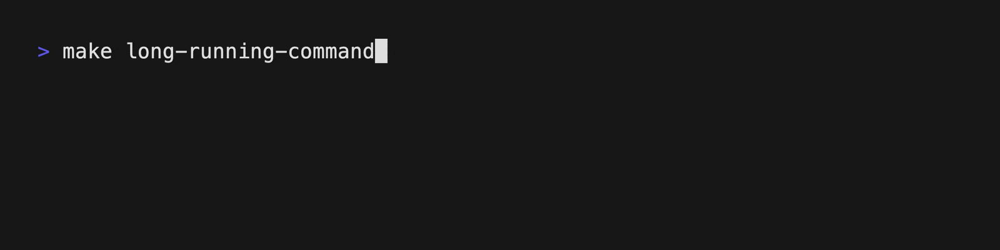

## ProgressLine

[](https://img.shields.io/badge/Platform-macOS-6464aa)
[](https://img.shields.io/badge/Platform-Linux-6464aa)
[](https://github.com/kattouf/ProgressLine/releases/latest)
[](https://img.shields.io/github/downloads/kattouf/ProgressLine/total?label=Downloads&logo=github)

Track commands progress in a compact one-line format.


| ⏳ `progressline` output |
|:--:|
|  |

| 📝 standart output |
|:--:|
|  |

## Usage

Simply pipe your command output into `progressline` to start tracking:

```sh
long-running-command | progressline
```

If the command you are executing also writes data to `stderr`, then you should probably use ["redirection"](https://www.gnu.org/software/bash/manual/html_node/Redirections.html) and send `stderr` messages to `stdout` so that they also go through the `progressline`:

``` sh
long-running-command 2>&1 | progressline
```

**ProgressLine** offers different styles to represent activity, they can be changed using `--activity-style`/`-s` option:

``` sh
long-running-command | progressline --activity-style { dots - default | kitt | snake }
# Example
long-running-command | progressline --activity-style snake
long-running-command | progressline -s snake
```

## Installation

### [Homebrew](https://brew.sh) (MacOS / Linux)

``` sh
brew install kattouf/progressline/progressline
```

### [Mint](https://github.com/yonaskolb/Mint) (MacOS)

``` sh
mint install kattouf/ProgressLine
```

### [Mise](Mise) (MacOS)

``` sh
mise use -g spm:kattouf/ProgressLine
```

### Manual Installation (MacOS / Linux)

Download the binary for your platform from the [releases page](https://github.com/kattouf/ProgressLine/releases), and place it in your executable path.

## Contributing

Feel free to open a pull request or a discussion.
