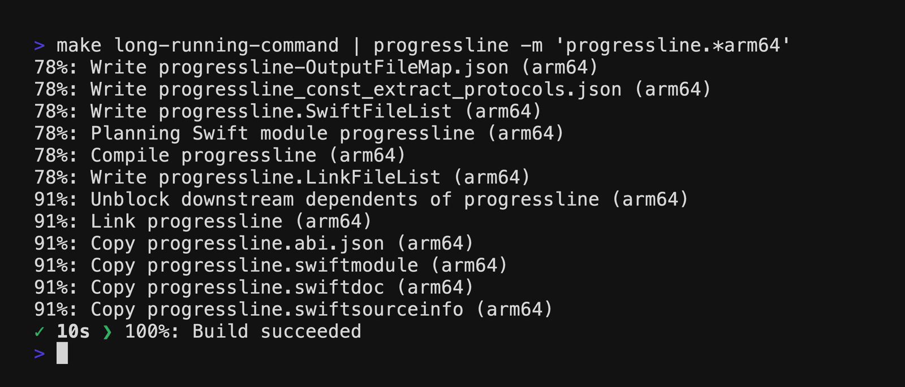

## ProgressLine


[](https://github.com/kattouf/ProgressLine/releases/latest)


Track commands progress in a compact one-line format.

| ⏳ `progressline` output |
|:--:|
|  |

| 📝 standard output |
|:--:|
|  |

[Usage](#usage) • [Features](#features) • [Installation](#installation)

## Usage

Simply pipe your command output into `progressline` to start tracking:

```sh
long-running-command | progressline
```

If the command you are executing also writes data to `stderr`, then you should probably use ["redirection"](https://www.gnu.org/software/bash/manual/html_node/Redirections.html) and send `stderr` messages to `stdout` so that they also go through the `progressline`:

``` sh
long-running-command 2>&1 | progressline
```

## Features

### Change Activity Indicator Styles

**ProgressLine** offers different styles to represent activity, they can be changed using `-s, --activity-style` argument:

``` sh
long-running-command | progressline --activity-style snake
```

Available styles:

| dots (Default) | snake | [kitt](https://en.wikipedia.org/wiki/KITT) |
|:--:|:--:|:--:|
|  |  |  |

### Highlight important lines

Log specific stdin lines above the progress line using the `-m, --log-matches` argument:

``` sh
long-running-command | progressline --log-matches "regex-1" --log-matches "regex-2"
```

| output |
|:--:|
|  |

### Use progress line as an addition to standard output

Log all stdin data above the progress line using the `-a, --log-all` argument:

```sh
long-running-command | progressline --log-all
```

### Save original log

You have two options for saving the full original log:

1. Using [tee](https://en.wikipedia.org/wiki/Tee_(command))

``` sh
long-running-command | tee original-log.txt | progressline
```

2. Using `-l, --original-log-path` argument:

``` sh
long-running-command | progressline --original-log-path original-log.txt
```

## Installation

### [Homebrew](https://brew.sh) (macOS / Linux)

``` sh
brew install progressline
```

<details>
  <summary>If you have macOS version older than Sonoma</summary>
  
  ``` sh
  brew install kattouf/progressline/progressline
  ```
  
</details>

### [Mint](https://github.com/yonaskolb/Mint) (macOS)

``` sh
mint install kattouf/ProgressLine
```

### [Mise](https://mise.jdx.dev) (macOS)

``` sh
mise use -g spm:kattouf/ProgressLine
```

### Manual Installation (macOS / Linux)

Download the binary for your platform from the [releases page](https://github.com/kattouf/ProgressLine/releases), and place it in your executable path.

## Contributing

Feel free to open a pull request or a discussion.
